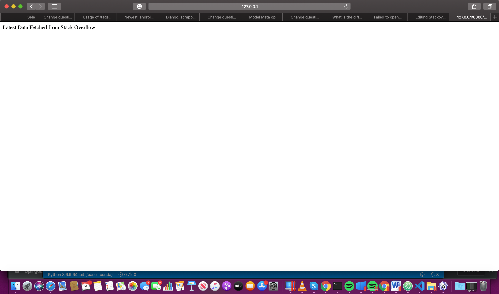

# Stackoverflow-django
work on stackapi with Django

for running the project just write the below link on VS code Terminal:
python3 manage.py runserver

In this project we have implemented the website which can scrap the newest android question and sorted by the number of votes.

by passing this url on your browser you can fetch all the data from stackoverflow
http://127.0.0.1:8000/stack/latest

